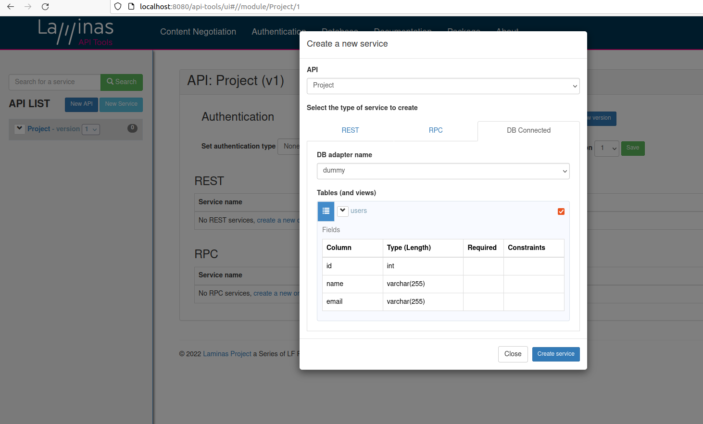
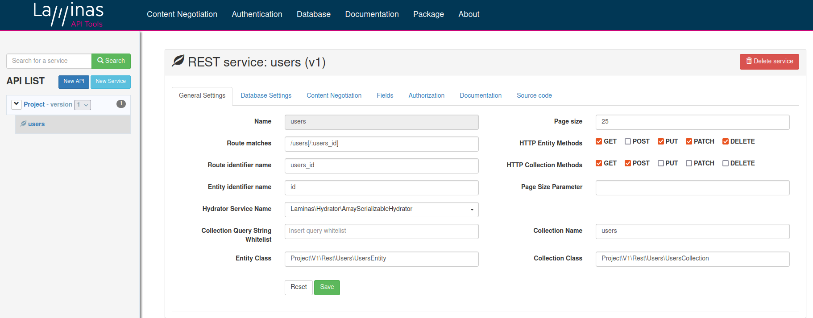
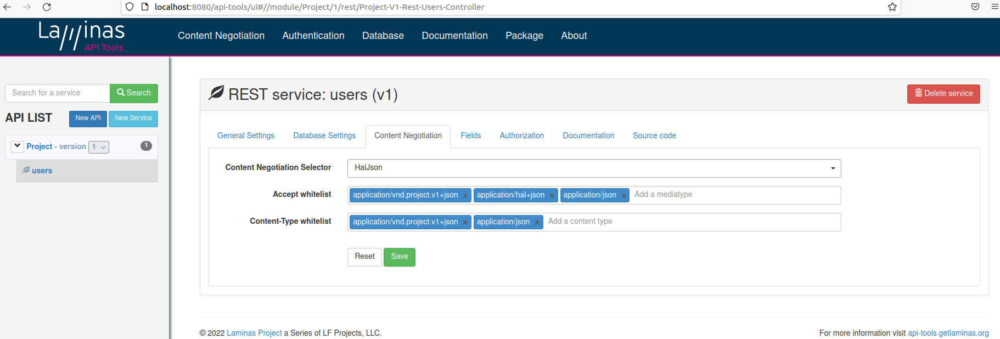

# REST

## Aula 1 - REST e Níveis de Maturidade

  - Representational state of transfer
  
  - Stateless
  
  - Cacheável
  
  - Níveis de maturidade (Richardson Maturity Model)
  
    - 0 - The Swamp of POX -> sem padronização
	
	- 1 - Utilização de resources (substativo do que está trabalhado)
	
	  - ```GET /products/1``` Buscar
	  
    - 2 - Utilizar o verbos HTTP certo para a operação correta
	
	  - GET - Recuperar a info
	  - POST - Inserir
	  - PUT Alterar
	  - Delete Remover
	  
    - 3 - HATEOAS (Hypermedia as the Engine of Application State)
	
	  - links com os próximos passos
	  
	  - API autoexplicável
	  
## Aula 2 - Method e Content Negotiation

  - URIs únicas
  
  - Operações para recursos, inclusive caching
  
  - Links relacionais para recursos exemplificando o que pode ser realizado
  
  - HAL, Collection+JSON e Siren
  
    - HAL: Hypermedia Application Language -> dados + dados complementares + links de como chegar nos recursos complementares
	
	  - [Hypertext Application Language (HAL)](https://apigility.org/documentation/api-primer/halprimer)
	    - fala também sobre first. prev, etc..
		
	  - Media type = application/hal+json
	  
	  - Traz o ```_links.self.href ``` com o link para o recurso atual
	  
	  - Traz o ```_embedded``` com a ligação de relacionamento
	  
	  - API fica mais rica: dados do recurso, os dados complementares e os links de como chegar aos recursos complementares
	
  - Method Negotiation
  
    - mètodo **OPTIONS** do HTTP: retorna os verbos disponíveis do resource
	
	```
	OPTIONS /api/product HTTP/1.1
	Host: fullcycle.com.br
	
	Resposta:
	HTTP/1.1 200 OK
	Allow: GET, POST
	
	Se fizer request para um verbo não permitido:
	HTTP/1.1 405 Not Allowed
	Allow: GET, POST
	
	```
	
  - Content Negotiation	-> vai nos headers da requisição -> Accept e Content-Type
  
    - **Accept** - Pedindo para devolver em um formato específico, no caso, um JSON 
	
	```  
	GET /product
	Accept: application/json

	Se não conseguir devolver no formato solicitado:
	HTTP/1.1 406 Not Acceptable  

	```
	
    - **Content-Type** - Definindo o formato que está enviando os dados, no caso, um JSON 
	
	```  
	POST /product HTTP/1.1
	Accept: application/json
	Content-Accept: application/json
	
	{
	  "name": "Produto 1"
	}

	Se o servidor não aceitar aquele Content-Accept:
	HTTP/1.1 415 Unsupported Media Type

	```
	
## Aula 3 - Instalando Laminas API Tools

    - $ mkdir laminas
	  
    - $ cd laminas
	  
    - (1) Instalar Extensão Visual Studio Code -> Dev Containers (da Microsoft) ms-vscode-remote.remote-containers
	
	  - Clicar em  Remote Explorer no VS Code \ Reopen the current...
	  
	  - Selecionar PHP com Maria DB -> será criado container php com banco de dados
	  
		```	
	  	$ php -v
		
      	PHP 7.4.33 (cli)
		```			  

    - (2) Acessar [https://api-tools.getlaminas.org/download](https://api-tools.getlaminas.org/download) 		  
	
	  - Executar ```$ composer create-project laminas-api-tools/api-tools-skeleton```
	  
	  - Atualmente na versão 1.8.0 não detectou as tabelas do sqlite na hora de usar o 'DB Connected' (Aula 6), usei a 1.5.3
	  
	    - ```$ composer create-project laminas-api-tools/api-tools-skeleton:1.5.3 ```
		
		- Na versao 1.5.3 nao funcionou o POST (Aula 6) :(
	  
	    - Se der erro, apagar a pasta 'api-tools-skeleton' e rodar com isso no final `` --ignore-platform-req=ext-intl ```
	  
    - (3) Em outra aba no VS Code:	  
	
		```
	  
	  	$ cd api-tools-skeleton
		$ sudo su
		$ apt-get update
		$ apt-get install sqlite3
		
		$ touch test.sqlite
		
		$ sqlite3 test.sqlite 		
		
		sqlite> create table users(id int, name varchar(255), email varchar(255));
		
		sqlite> .tables
		users
		
		control D
		control D
		
		// startar aplicação na porta 8080 com servidor embutido do php		
		vscode ➜ /workspace/api-tools-skeleton $ php -S 0.0.0.0:8080 -t public public/index.php
		
		  [Thu Dec  1 16:28:34 2022] PHP 7.4.33 Development Server (http://0.0.0.0:8080) started				
		  
	
		```
		
    - (4) Navegador http://localhost:8080/		
	
## Aula 4 - Ambiente para executar o Laminas API Tools

  - [https://github.com/marciafc/api-tools-skeleton](https://github.com/marciafc/api-tools-skeleton)

```
Para facilitar a execução do API Tools com Docker, criamos um esqueleto da aplicação já com Docker para facilitar os testes.

O projeto está em: https://github.com/codeedu/api-tools-skeleton.

Clone o projeto e execute os seguintes comandos:

$ docker build -t api-tools-test .

$ docker run -p 8000:80 -v $(pwd):/var/www api-tools-test

Agora basta testar no browser http://localhost:8000

```
	
## Aula 5 - Usando imagem oficial do PHP do Docker Hub

  - Na última aula eu sei a imagem PHP da Microsoft disponível no VSCode que já vem com PHP e Composer, mas tem alunos que preferem testar com a imagem PHP oficial que está no Docker Hub. Esta imagem não vem com o Composer instalado.

  - Para instala-lo na imagem, precisamos criar um Dockerfile:	
  
```  
FROM composer as composer

FROM php:VERSION

COPY --from=composer /usr/bin/composer /usr/bin/composer  

```

Desta forma, através do multi-stage build do Docker, pegamos uma imagem do Composer e copiamos o executável dele para a imagem PHP.

## Aula 6 - Content Negotiation na Pratica

  - Após ter realizado a Aula 3
  
  - http://localhost:8080
  
  - Criar API 'Project'
  
  - Definir adapter do database como Driver= PDO_Sqlite e Database=test.sqlite
  
  - Criar service com 'DB Connected' (já descobre as tabelas do banco e cria os endpoints)
  
  - IMPORTANTE: Content Negociation pode conter no header além do media type ```application/hal+json``` o media type com a versão da api: ```application/vnd.nome-da-api.v1+json```







  - Temos os endpoints sem codar nada! Exemplos: GET http://localhost:8080/users, POST http://localhost:8080/users
  